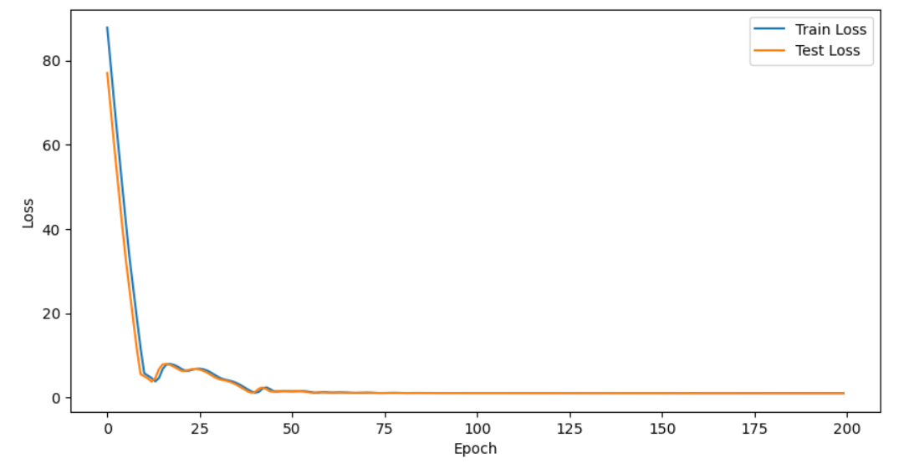
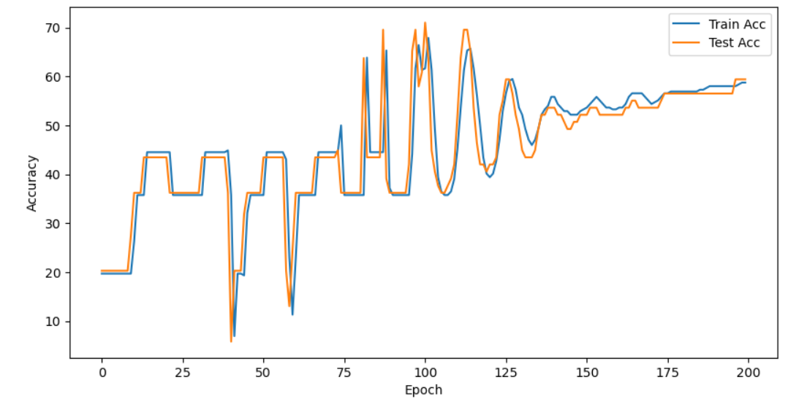
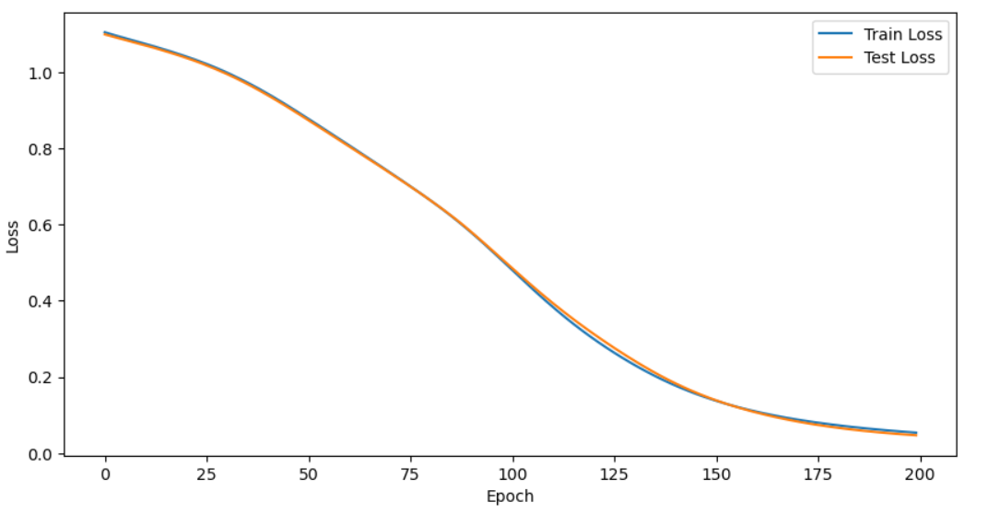
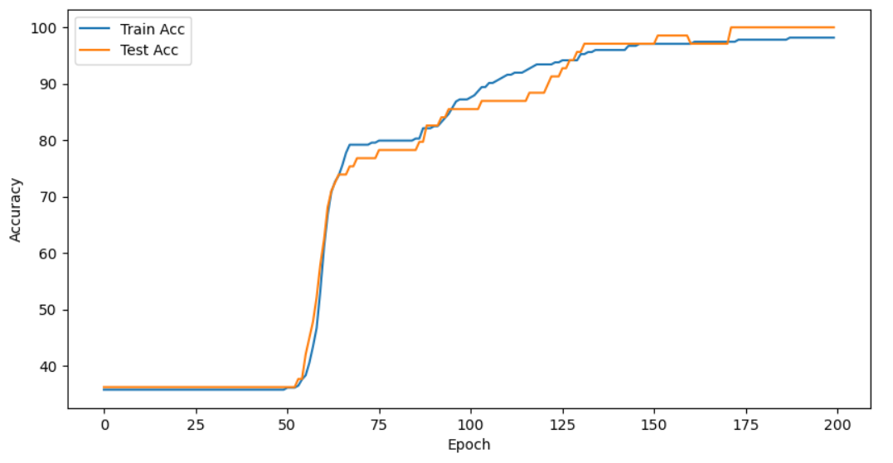
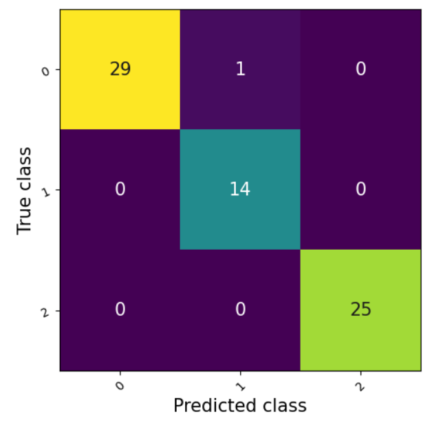

# 🐧 DeepPenguin: Multi-Class Species Classification via Deep Neural Networks

Bu proje, Palmer Penguenleri veri seti kullanılarak geliştirilmiş, 3 farklı penguen türünü (Adelie, Chinstrap, Gentoo) fiziksel anatomik özelliklerine göre sınıflandıran **PyTorch** tabanlı bir Derin Öğrenme (Deep Learning) modelidir. Proje aynı zamanda **Flask** ile geliştirilmiş, Glassmorphism tasarım diline sahip modern bir web arayüzü içermektedir.

## 🧠 Model Mimarisi ve Hiperparametreler
Model, doğrusal olmayan karmaşık ilişkileri öğrenebilmesi için ardışık (Sequential) tam bağlantılı (Fully Connected) katmanlardan oluşturulmuştur:
- **Girdi Katmanı:** 4 Özellik (Gaga Uzunluğu, Gaga Kalınlığı, Kanat Uzunluğu, Vücut Ağırlığı)
- **Gizli Katmanlar:** 3 adet `nn.Linear` (16 nöronlu) ve `ReLU` aktivasyon fonksiyonları.
- **Çıktı Katmanı:** 3 Sınıf (Türler)
- **Loss Fonksiyonu:** CrossEntropyLoss
- **Optimizasyon:** Adam Optimizer (lr=0.001)

---

## 🔬 Veri Standardizasyonunun (StandardScaler) Model Üzerindeki Bilimsel Etkisi

Makine öğrenmesinde özelliklerin (features) farklı ölçeklerde olması, modelin optimizasyon sürecini doğrudan etkiler. Bu projede, vücut ağırlığı ~4000g seviyelerindeyken gaga kalınlığının ~15mm seviyelerinde olmasının yarattığı gradyan dengesizliği deneysel olarak kanıtlanmıştır.

### 1. Ölçeklendirme Yapılmadan Önceki Durum (Unscaled Data)
Özellikler standardize edilmediğinde, büyük sayısal değerlere sahip sütunlar kayıp (loss) fonksiyonunu domine etmiştir.
* **Loss Analizi:** Başlangıç kaybı devasa boyutlara (~85) ulaşmış ve optimizasyon algoritması minimumu bulmakta zorlanmıştır[cite: 31].
* **Accuracy Analizi:** Doğruluk grafiği %10 ile %70 arasında son derece şiddetli ve istikrarsız dalgalanmalar (osilasyon) yaşamış, model hiçbir zaman tam olarak yakınsayamamıştır (converge edememiştir)[cite: 35].

<p align="center">
  
  
</p>

### 2. Ölçeklendirme Yapıldıktan Sonraki Durum (Scaled Data)
Veri seti `StandardScaler` ile ortalaması 0, standart sapması 1 olacak şekilde normalize edildikten sonra (Z-Score Normalization), modelin öğrenme dinamiği tamamen değişmiştir.
* **Loss Analizi:** 3 sınıflı bir problem için matematiksel olarak beklenen başlangıç kaybı (~1.1) ile eğitime başlanmış ve kayıp fonksiyonu pürüzsüz (smooth) bir şekilde sıfıra asimptotik olarak yaklaşmıştır[cite: 34].
* **Accuracy Analizi:** Dalgalanmalar tamamen yok olmuş, eğitim (Train) ve test (Test) doğrulukları istikrarlı bir biçimde artarak %100 seviyesine ulaşmıştır[cite: 33]. Aşırı öğrenme (Overfitting) gözlemlenmemiştir.

<p align="center">
  
  
</p>

---

## 📊 Model Performansı ve Confusion Matrix

Test veri seti üzerinde yapılan değerlendirmeler sonucunda modelin sınıflandırma yeteneği Confusion Matrix ile görselleştirilmiştir[cite: 32]. 
* **Sınıf 0 (Adelie):** 29 Doğru, 1 Yanlış
* **Sınıf 1 (Chinstrap):** 14 Doğru, 0 Yanlış
* **Sınıf 2 (Gentoo):** 25 Doğru, 0 Yanlış

Model, yalnızca tek bir örneği yanlış sınıflandırmış olup geri kalan tüm verilerde muazzam bir kesinlik (precision) ve duyarlılık (recall) sergilemiştir[cite: 32].

<p align="center">
  
</p>

---

## 🚀 Projeyi Bilgisayarınızda Çalıştırma (Testing)

Bu projeyi kendi bilgisayarınızda test etmek ve modern Flask arayüzünü deneyimlemek için aşağıdaki adımları izleyebilirsiniz.

**1. Repoyu Klonlayın:**
```bash
git clone [https://github.com/KULLANICI_ADIN/DeepPenguin.git](https://github.com/KULLANICI_ADIN/DeepPenguin.git)
cd DeepPenguin
